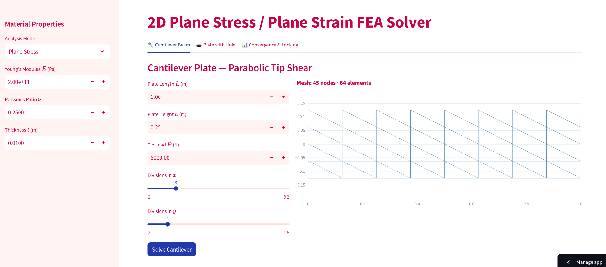
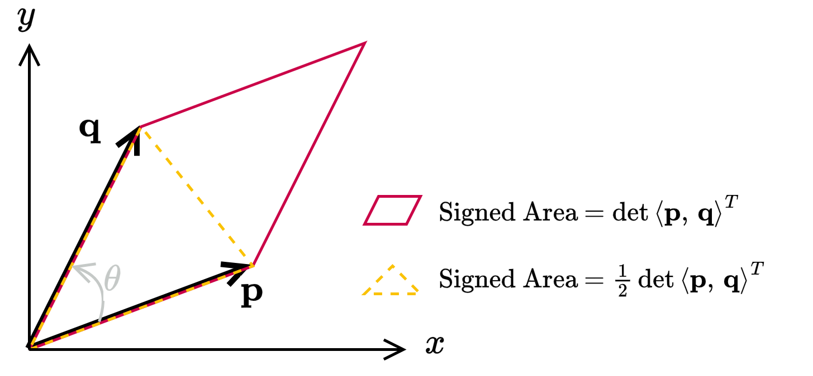
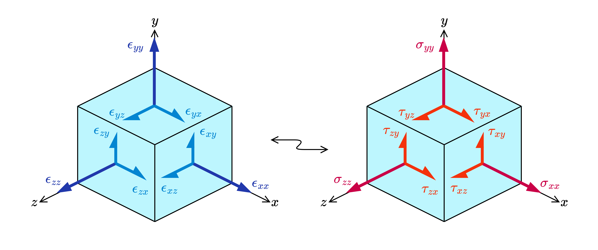
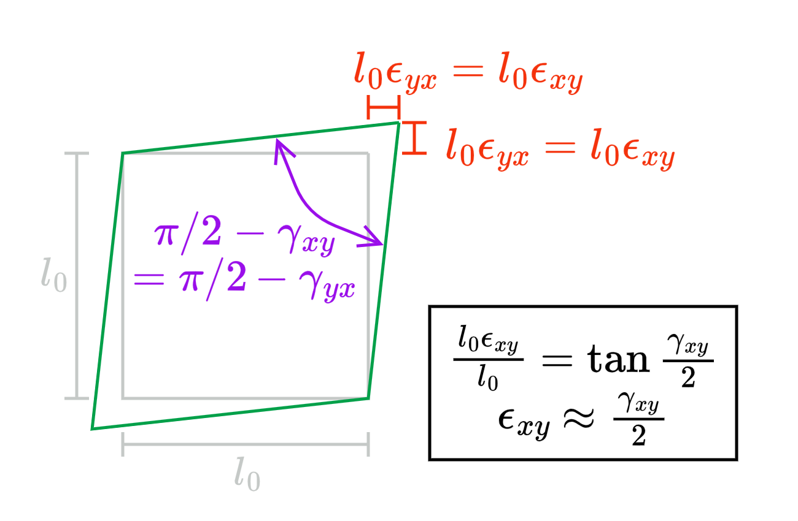
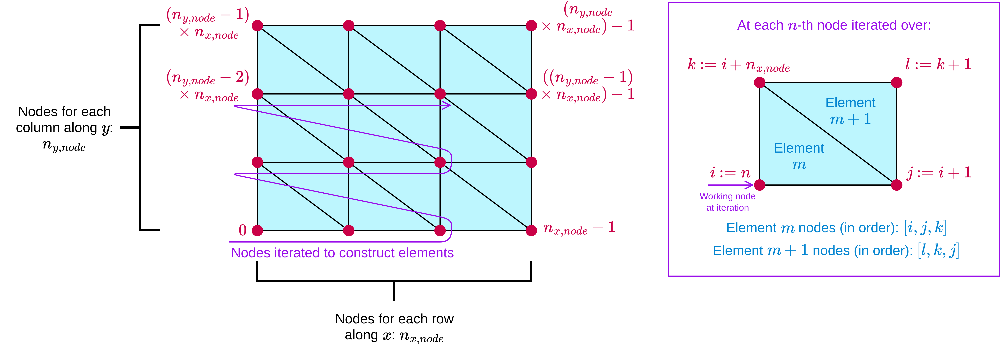
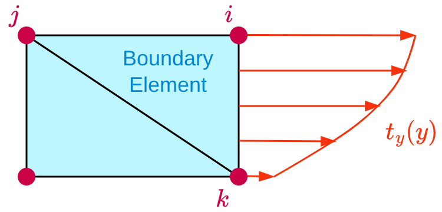

# CIVL 537 CST FEA Solver

<p align="center">

</p>

------

## Overview

This is a Constant Strain Triangle (CST) Finite Element Analysis (FEA) solver
developed as part of a class project for UBC Civil 537 (Computation Mechanics).
The resulting application uses **CST elements** to analyze a **Cantilever beam
loaded with parabolic tip shear** as well as a **Plate with hole loaded with
edge stress** for **linear-elastic isotropic materials**. Please see the
[project description](./Project_02_Description.md) for initial task sheet.

### How to Run

#### Running Online WebApp

+ The app may be accessed without any installations via the [live WebApp hosted
  on Streamlit](https://civl537-fea-solver-project.streamlit.app/). 
+ For users who want to self-deploy, please see: [guide to Streamlit
  deployment](https://docs.streamlit.io/deploy/streamlit-community-cloud)

------

#### Running with Docker

1. Download or clone this repo.
```bash
git clone https://github.com/mxpx1412/civl537-fea-solver.git
```
2. Install Docker:
    + **Option 1 - Desktop**: install [Docker
      Desktop](https://www.docker.com/products/docker-desktop/)
    + **Option 2 - Docker Engine + Compose Plugin** (Linux Only): 
        + Install the [Docker Engine](https://docs.docker.com/engine/)
        + Install the [Docker Compose
          plugin](https://docs.docker.com/compose/install/linux/)
3. In the repo directory, run docker compose:
```bash
docker compose up
```
4. If `docker compose` is successful, open `http://localhost:8501`

------

#### Running Tests

If [docker set-up](#running-with-docker) is successful, the unit tests in
`/tests` can be ran using:

```bash
docker compose run fea-solver pytest test/test_assembly.py -v
```

Expected results:

```bash
tests/test_assembly.py::test_K_shape PASSED                              [  6%]
tests/test_assembly.py::test_K_symmetric PASSED                          [ 12%]
tests/test_assembly.py::test_R_equilibrium PASSED                        [ 18%]
tests/test_elements.py::test_area_known_triangle PASSED                  [ 25%]
tests/test_elements.py::test_area_negative_orientation PASSED            [ 31%]
tests/test_elements.py::test_B_matrix_shape PASSED                       [ 37%]
tests/test_elements.py::test_B_rigid_body_motion PASSED                  [ 43%]
tests/test_elements.py::test_B_known_values PASSED                       [ 50%]
tests/test_elements.py::test_k_symmetric PASSED                          [ 56%]
tests/test_elements.py::test_k_positive_semidefinite PASSED              [ 62%]
tests/test_elements.py::test_D_plane_stress_vs_plane_strain PASSED       [ 68%]
tests/test_elements.py::test_D_plane_stress_symmetry PASSED              [ 75%]
tests/test_solver.py::test_fixed_dofs_zero PASSED                        [ 81%]
tests/test_solver.py::test_strain_energy_positive PASSED                 [ 87%]
tests/test_solver.py::test_tip_deflection_order_of_magnitude PASSED      [ 93%]
tests/test_solver.py::test_patch_test PASSED                             [100%]
```

------

#### App UI Usage Overview

The app has the following main elements:

+ **Side bar**: allows for user input of material properties.
+ **Cantilever Tab**: takes user inputs on cantilever geometry, loading,
  and meshing. Analyzes a cantilever beam and outputs resulting plots.
+ **Plate with Hole Tab**: takes user inputs on plate geometry, loading, and
  meshing. Analyzes a double-symmetric plate (only 1st quadrant shown by
  symmetry) with hole loaded on the right edge and outputs resulting plots.
+ **Convergence and Locking**: runs convergence rate and locking studies,
  please see discussion [below](#part-8---investigation)

------
------

## Mechanics and Implementation Discussion

The mechanics and implementation is discussed in greater depth in this section.
For how to run the project, please see [above](#how-to-run).

### Part 1 - Repository Set-up

+ The set-up of Docker and the Git / GitHub followed closely with the provided
  guide. 
+ Instead of Docker desktop, the docker engine and associated tools were
  installed locally to the student device running the Debian 13 (Trixie) 
  GNU/Linux OS using the corresponding [installation
  guide](https://docs.docker.com/engine/install/debian/).
+ The starter app was successfully launched locally. Deployment to Streamlit
  was also successful. 

------

### Part 2 - CST Element Formulation

#### Area Computation

The signed area of a *parallelogram* spanned by two vectors $\langle p
\rangle=\langle p_1,p_2\rangle$ and $\langle q \rangle=\langle
q_1,q_2\rangle$ sharing a common starting point is given by: 

$$
\begin{align}
\det{\left(
\begin{bmatrix}
    p_1 & p_2 \\
    q_1 & q_2 
\end{bmatrix} \right)} 
&= \text{Area of Parallelogram Spanned}
\end{align}
$$

Where the area is positive if the shared point, the tip of $\langle p \rangle$
and the tip of $\langle q \rangle$ is ordered counterclockwise (i.e. lesser
angle from $\langle p \rangle$ to $\langle q \rangle$ is counterclockwise), and
negative if opposite [^citeFrose18]. Then, the signed area of the *triangle*
spanned by the two vectors is simply half of the above expression. in other
words:

$$
\begin{align}
\Delta &:=
\frac{1}{2}
\det{\left(
\begin{bmatrix}
    p_1 & p_2 \\
    q_1 & q_2 
\end{bmatrix} \right)} 
= \text{Area of Triangle Spanned}
\end{align}
$$

<p align="center">

</p>

For the CST element implementation, three points $(x_0, y_0)$, $(x_1, y_1)$ and
$(x_2, y_2)$ are given. The above formula was used on the vector from $(x_0,
y_0)$ to $(x_1, x_1)$ and the vector from $(x_0, y_0)$ to $(x_2, y_2)$, in
otherwords: 

$$
\begin{align}
\Delta &= 
\frac{1}{2}
\det\left(
\begin{bmatrix}
(x_1 - x_0) & (y_1 - y_0) \\
(x_2 - x_0) & (y_2 - y_0) \\
\end{bmatrix}
\right)
\end{align}
$$

#### Shape Functions and Strain Displacement Matrix

The shape functions $[N]$ and the strain-displacement matrix
$[B]$ are derived based on the lecture notes [^citeL6Fahimi26]. For the
CST, the nodal displacement DOFs $u$ and $v$ can be written as linear
combinations of $x$ and $y$:

$$
\begin{align}
u(x, y)
    &= \alpha_1 + \alpha_2 x + \alpha_3 y \\
v(x, y)
    &= \beta_1 + \beta_2 x + \beta_3 y 
\end{align}
$$

The strains can be written as:

$$
\begin{align}
    \begin{Bmatrix}
        \epsilon_x \\
        \epsilon_y \\
        \gamma_{xy} \\
    \end{Bmatrix}
        &=
    \begin{Bmatrix}
        \frac{\partial u}{\partial x} \\
        \frac{\partial v}{\partial y} \\
        \frac{\partial u}{\partial y} + 
        \frac{\partial v}{\partial x} \\
    \end{Bmatrix}
    =
    \begin{Bmatrix}
        \alpha_2 \\
        \beta_3 \\
        \alpha_3 + \beta_2 \\
    \end{Bmatrix}
    = \text{Constant Vector}
\end{align}
$$

Then at each element's nodes $i$, $j$, $k$, we have:

$$
\begin{align}
    u_i &= \alpha_1 + \alpha_2 x_i + \alpha_3 y_i \\
    u_j &= \alpha_1 + \alpha_2 x_j + \alpha_3 y_j \\
    u_k &= \alpha_1 + \alpha_2 x_k + \alpha_3 y_k \\
    v_i &= \beta_1 + \beta_2 x_i + \beta_3 y_i \\
    v_j &= \beta_1 + \beta_2 x_j + \beta_3 y_j \\
    v_k &= \beta_1 + \beta_2 x_k + \beta_3 y_k 
\end{align}
$$

In matrix form, we can write:

$$
\begin{align}
\begin{Bmatrix}
    u_i \\ 
    u_j \\ 
    u_k \\
\end{Bmatrix}
&= 
\underbrace{
\begin{bmatrix}
1 & x_i & y_i \\
1 & x_j & y_j \\
1 & x_k & y_k \\
\end{bmatrix}}_{[A]}
\underbrace{
\begin{Bmatrix}
    \alpha_1 \\ 
    \alpha_2 \\ 
    \alpha_3 \\
\end{Bmatrix}}_{\begin{Bmatrix}\alpha\end{Bmatrix}} \\
\begin{Bmatrix}
    v_i \\ 
    v_j \\ 
    v_k \\
\end{Bmatrix}
&= 
\underbrace{
\begin{bmatrix}
1 & x_i & y_i \\
1 & x_j & y_j \\
1 & x_k & y_k \\
\end{bmatrix}}_{[A]}
\underbrace{
\begin{Bmatrix}
    \beta_1 \\ 
    \beta_2 \\ 
    \beta_3 \\
\end{Bmatrix}}_{\begin{Bmatrix}\beta\end{Bmatrix}}
\end{align}
$$

Solving for the coefficients $\alpha_n$ and $\beta_n$, we first invert the
matrix $[A]$:

$$
\begin{align}
    [A]^{-1}
    &= \frac{1}{\det[A]}
    \begin{bmatrix}
        x_j y_k - x_k y_j & x_k y_i - x_i y_k & x_i y_j - x_j y_i \\
        y_j - y_k & y_k - y_i & y_i - y_j \\
        x_k - x_j & x_i - x_k & x_j - x_i \\
    \end{bmatrix} 
    = \frac{1}{2\Delta}
    \begin{bmatrix}
        a_i & a_j & a_k \\
        b_i & b_j & b_k \\
        c_i & c_j & c_k \\
    \end{bmatrix}
\end{align}
$$

Where the signed area of the triangle $\Delta$ was previously defined. Then
solving the coefficients, we have: 

$$
\begin{align}
\begin{Bmatrix}
    \alpha_1 \\ 
    \alpha_2 \\ 
    \alpha_3 \\
\end{Bmatrix}
&= 
\frac{1}{2\Delta}
\begin{bmatrix}
    a_i & a_j & a_k \\
    b_i & b_j & b_k \\
    c_i & c_j & c_k \\
\end{bmatrix}
\begin{Bmatrix}
    u_i \\ 
    u_j \\ 
    u_k \\
\end{Bmatrix} \\
\begin{Bmatrix}
    \beta_1 \\ 
    \beta_2 \\ 
    \beta_3 \\
\end{Bmatrix}
&=
\frac{1}{2\Delta}
\begin{bmatrix}
    a_i & a_j & a_k \\
    b_i & b_j & b_k \\
    c_i & c_j & c_k \\
\end{bmatrix}
\begin{Bmatrix}
    v_i \\ 
    v_j \\ 
    v_k \\
\end{Bmatrix} \\
\end{align}
$$

Then substituting these coefficients back into 
$u(x, y) = \alpha_1 + \alpha_2 x + \alpha_3 y$ 
and $v(x, y) = \beta_1 + \beta_2 x + \beta_3 y$, then gathering terms by $u_n$
and $v_n$, we have:

$$
\begin{align}
u(x, y) 
    &=
    \sum_{n=i,j,k}
    \underbrace{
    \frac{1}{2\Delta}
    (a_n + b_n x + c_n y)}_{N_n} u_n 
    = \sum_{n=i,j,k} N_n u_n \\
v(x, y) 
    &=
    \sum_{n=i,j,k}
    \underbrace{
    \frac{1}{2\Delta}
    (a_n + b_n x + c_n y)}_{N_n} v_n
    = \sum_{n=i,j,k} N_n v_n \\
N_n
    &= \frac{1}{2\Delta} (a_n + b_n x + c_n y)
\end{align}
$$

In matrix form, the ***shape functions*** $[N]$ can be written: 

$$
\begin{align}
\begin{Bmatrix}
    u(x, y) \\
    v(x, y) \\
\end{Bmatrix}
&=
\underbrace{
\begin{bmatrix}
    N_i & 0 & N_j & 0 & N_k & 0 \\
    0 & N_i & 0 & N_j & 0 & N_k \\
\end{bmatrix}
}_{[N]}
\underbrace{
\begin{Bmatrix}
    u_i \\
    v_i \\
    u_j \\
    v_j \\
    u_k \\
    v_k \\
\end{Bmatrix}
}_{\begin{Bmatrix}s\end{Bmatrix}}
= [N]\begin{Bmatrix}s\end{Bmatrix}
\end{align}
$$

Then, we can compute the ***strain-displacement matrix*** $[B]$ using
the definition of the strains: 

$$
\begin{align}
    \begin{Bmatrix}
        \epsilon_x \\
        \epsilon_y \\
        \gamma_{xy} \\
    \end{Bmatrix}
    &=
    \begin{Bmatrix}
        \frac{\partial u}{\partial x} \\
        \frac{\partial v}{\partial y} \\
        \frac{\partial u}{\partial y} + 
        \frac{\partial v}{\partial x} \\
    \end{Bmatrix}
    =
    \begin{Bmatrix}
        \alpha_2 \\
        \beta_3 \\
        \alpha_3 + \beta_2 \\
    \end{Bmatrix} \\
    \begin{Bmatrix}
        \epsilon_x \\
        \epsilon_y \\
        \gamma_{xy} \\
    \end{Bmatrix}
    &= \frac{1}{2\Delta}
    \begin{Bmatrix}
    b_i u_i + b_j u_j + b_k u_k \\
    c_i v_i + c_j v_j + c_k v_j \\
    c_i u_i + c_j u_j + c_k u_k + b_i v_i + b_j v_j + b_k v_k \\
    \end{Bmatrix} \\
    \begin{Bmatrix}
        \epsilon_x \\
        \epsilon_y \\
        \gamma_{xy} \\
    \end{Bmatrix}
    &= 
    \underbrace{
    \frac{1}{2\Delta}
    \begin{bmatrix}
    b_i & 0 & b_j & 0 & b_k & 0 \\
    0 & c_i & 0 & c_j & 0 & c_k \\
    c_i & b_i & c_j & b_j & c_k & b_k \\
    \end{bmatrix}}_{[B]}
    \begin{Bmatrix}
    u_i \\
    v_i \\
    u_j \\
    v_j \\
    u_k \\
    v_k \\
    \end{Bmatrix} = [B]\begin{Bmatrix}s\end{Bmatrix} 
\end{align}
$$

The above results for $[B]$ is used for the element implementation of
the CSTs.

#### Constitutive Matrix

The strains and stresses involved in the strain and stress tensors of 3D solids
are illustrated as follows:

<p align="center">

</p>

For an isotropic material in equilibrium, it requires $\tau_{ij}=\tau_{ji}$ for
the shear stresses and $\epsilon_{ij} = \epsilon_{ji}$ for the shear strains.
Further, the shear strains are often re-written in terms of ***engineering
shear strain*** as follows [^citeC2_2Bowers25]:

$$
\gamma_{ij}=\gamma_{ji} = 2\epsilon_{ij} = 2\epsilon_{ji}
$$

<p align="center">

</p>

The constitutive relations for an isotropic material are[^citeC3_2Bowers25]:

$$
\begin{align}
\epsilon_{ii} 
&= \frac{\sigma_{ii}}{E} 
    - \nu \frac{\sigma_{jj}}{E} 
    - \nu \frac{\sigma_{kk}}{E} \\
\gamma_{ij}
&= \frac{\tau_{ij}}{G}
\end{align}
$$

Where $E$ is the ***Elastic modulus***, $\nu$ is the ***Poisson's ratio***, and
$G$ is the ***shear modulus***, which for an isotropic material is:

$$
\begin{align}
G &= \frac{E}{2(1+\nu)}
\end{align}
$$

In matrix form, we have: 

$$
\begin{align}
\begin{Bmatrix}
    \epsilon_{xx} \\
    \epsilon_{yy} \\
    \epsilon_{zz} \\
    \gamma_{yz} \\
    \gamma_{xz} \\
    \gamma_{xy} \\
\end{Bmatrix}
&=
\frac{1}{E}
\begin{bmatrix}
    1 & -\nu & -\nu & 0 & 0 & 0 \\
    -\nu & 1 & -\nu & 0 & 0 & 0 \\
    -\nu & -\nu & 1 & 0 & 0 & 0 \\
    0 & 0 & 0 & 2(1+\nu) & 0 & 0 \\
    0 & 0 & 0 & 0 & 2(1+\nu) & 0 \\
    0 & 0 & 0 & 0 & 0 & 2(1+\nu) \\
\end{bmatrix}
\begin{Bmatrix}
    \sigma_{xx} \\
    \sigma_{yy} \\
    \sigma_{zz} \\
    \tau_{yz} \\
    \tau_{xz} \\
    \tau_{xy} \\
\end{Bmatrix}
\end{align}
$$

Taking the inverse, we will obtain the general constitutive matrix for an
isotropic 3D material: 

$$
\begin{align}
\begin{Bmatrix}
    \sigma_{xx} \\
    \sigma_{yy} \\
    \sigma_{zz} \\
    \tau_{yz} \\
    \tau_{xz} \\
    \tau_{xy} \\
\end{Bmatrix}
&=
\underbrace{
\frac{E}{(1+\nu)(1-2\nu)}
\begin{bmatrix}
    1-\nu & \nu & \nu & 0 & 0 & 0 \\
    \nu & 1-\nu & \nu & 0 & 0 & 0 \\
    \nu & \nu & 1-\nu & 0 & 0 & 0 \\
    0 & 0 & 0 & \frac{1-2\nu}{2} & 0 & 0 \\
    0 & 0 & 0 & 0 & \frac{1-2\nu}{2} & 0 \\
    0 & 0 & 0 & 0 & 0 & \frac{1-2\nu}{2} \\
\end{bmatrix}}_{[D]}
\underbrace{
\begin{Bmatrix}
    \epsilon_{xx} \\
    \epsilon_{yy} \\
    \epsilon_{zz} \\
    \gamma_{yz} \\
    \gamma_{xz} \\
    \gamma_{xy} \\
\end{Bmatrix}}_{\begin{Bmatrix}\epsilon\end{Bmatrix}}
= [D]\begin{Bmatrix}\epsilon\end{Bmatrix}
\end{align}
$$

By setting $\sigma_{zz}=\tau_{yz}=\tau_{xz}=0$, we obtain the ***Plane Stress
Constitutive Matrix*** as provided in the lecture
[^citeL6Fahimi26] [^citeC3_2Bowers25]:

$$
\begin{align}
[D]
&=
\frac{E}{1-\nu^2}
\begin{bmatrix}
1 & \nu & 0 \\
\nu & 1 & 0 \\
0 & 0 & \frac{1-\nu}{2} \\
\end{bmatrix}
\end{align}
$$

On the other hand, by setting $\epsilon_{zz}=\epsilon_{yz}=\epsilon_{xz}=0$,
the ***Plane Strain Constitutive Matrix*** is obtained:

$$
\begin{align}
[D]
&=
\frac{E(1-\nu)}{(1+\nu)(1-2\nu)}
\begin{bmatrix}
1 & \frac{\nu}{1-\nu} & 0 \\
\frac{\nu}{1-\nu} & 1 & 0 \\
0 & 0 & \frac{1-2\nu}{2(1-\nu)} \\
\end{bmatrix}
\end{align}
$$

The above matrices were implemented accordingly. 

#### Stiffness Matrix

Based on the principle of virtual work formulation, the element stiffness
matrix $[k_e]$ is:

$$
\begin{align}
[k_e] 
&= \int_{V_e} [B]^T [D] [B] dV \\
[k_e] 
&= \iiint [B]^T [D] [B] dx dy dz
\end{align}
$$

For the CST element, based on the earlier derived $[B]$ and $[D]$, we see that
they do not depend on the variables of integration (only pre-defined nodal
coordinates and material properties). If the thickness of the elemnt is $t_h$,
then the expression simplifies to:

$$
\begin{align}
[k_e] 
&= [B]^T [D] [B] t_h \iint dx dy \\
[k_e] 
&= [B]^T [D] [B] t_h \Delta
\end{align}
$$

Which provides the element stiffness matrix for implementation. 

#### Hand Verification Example

The strain-displacement matrix $[B]$ is verified using hand calculation with
the following points: 

$$
\begin{align}
(x_i, y_i) &= (0, 0) \\
(x_j, y_j) &= (1, 0) \\
(x_k, y_k) &= (0, 1) 
\end{align}
$$

Computing coefficients: 

$$
\begin{align}
a_i 
    &= x_j y_k - x_k y_j = 1 \times 1 - 0 \times 0 = 1 \\
a_j 
    &= x_k y_i - x_i y_k = 0 \times 0 - 0 \times 1 = 0 \\
a_k 
    &= x_i y_j - x_j y_i = 0 \times 0 - 1 \times 0 = 0 \\
b_i 
    &= y_j - y_k = 0 - 1 = -1 \\
b_j 
    &= y_k - y_i = 1 - 0 = 1 \\
b_k 
    &= y_i - y_j = 0 - 0 \\
c_i 
    &= x_k - x_j = 0 - 1 = -1 \\
c_j 
    &= x_i - x_k = 0 - 0 = 0 \\
c_k 
    &= x_j - x_i = 1 - 0 = 1
\end{align}
$$

Compute area:

$$
\begin{align}
\Delta
    &= \frac{1}{2}\det\left(
    \begin{bmatrix}
    x_j - x_i & y_j - y_i \\
    x_k - x_i & y_k - y_i \\
    \end{bmatrix}
    \right) \\
\Delta
    &= \frac{1}{2}\det\left(
    \begin{bmatrix}
    1 & 0 \\
    0 & 1 \\
    \end{bmatrix}
    \right) = \frac{1}{2} \\
2\Delta
    &= 1
\end{align}
$$

Computing shape functions: 

$$
\begin{align}
N_n 
    &= \frac{1}{2\Delta}(a_n + b_n x + c_n y) \\
\implies
N_i 
    &= 1 - x - y \\
N_j 
    &= x \\
N_k 
    &= y 
\end{align}
$$

Check shape functions:

$$
\begin{align}
\sum_{n=i,j,k} N_n 
    &= 1 - x - y + x + y = 1 \implies \text{ok} \\
\end{align}
$$

$$
\begin{align}
    N_i(0,0) &= 1 + 0 + 0 = 1 \implies \text{ok} \\
    N_j(0,0) &= 0 \implies \text{ok} \\
    N_k(0,0) &= 0 \implies \text{ok} 
\end{align}
$$

$$
\begin{align}
    N_i(1,0) &= 1 - 1 + 0 = 0 \implies \text{ok} \\
    N_j(1,0) &= 1 \implies \text{ok} \\
    N_k(1,0) &= 0 \implies \text{ok} 
\end{align}
$$

$$
\begin{align}
    N_i(0,1) &= 1 - 0 + 1 = 0 \implies \text{ok} \\
    N_j(0,1) &= 0 \implies \text{ok} \\
    N_k(0,1) &= 1 \implies \text{ok} 
\end{align}
$$

Differentiate shape functions:

$$
\begin{align}
\begin{matrix}
\frac{\partial N_i}{\partial x}
    = -1 
& \frac{\partial N_j}{\partial x}
    = 1 
& \frac{\partial N_k}{\partial x}
    = 0 \\
\frac{\partial N_i}{\partial y}
    = -1 
& \frac{\partial N_j}{\partial y}
    = 0 
& \frac{\partial N_k}{\partial y}
    = 1 \\
\end{matrix}
\end{align}
$$

Compute strain vector and strain-displacement matrix:

$$
\begin{align}
\begin{Bmatrix}
\epsilon_x \\
\epsilon_y \\
\gamma_{xy}
\end{Bmatrix}
&=
\begin{Bmatrix}
\frac{\partial u}{\partial x} \\
\frac{\partial v}{\partial y}  \\
\frac{\partial u}{\partial y} 
    +\frac{\partial v}{\partial x} \\
\end{Bmatrix} =
\begin{Bmatrix} 
\frac{\partial N_n}{\partial x} u_n \\
\frac{\partial N_n}{\partial y} v_n \\
\frac{\partial N_n}{\partial y} u_n 
    +\frac{\partial N_n}{\partial x} v_n \\
\end{Bmatrix} \\
\begin{Bmatrix}
\epsilon_x \\
\epsilon_y \\
\gamma_{xy}
\end{Bmatrix}
&=
\begin{Bmatrix}
-u_i + u_j \\
-v_i + v_k \\
-u_i - v_i + v_j + u_k \\
\end{Bmatrix} \\
\begin{Bmatrix}
\epsilon_x \\
\epsilon_y \\
\gamma_{xy}
\end{Bmatrix}
&=
\underbrace{
\begin{bmatrix}
-1 & 0 & 1 & 0 & 0 & 0 \\
0 & -1 & 0 & 0 & 0 & 1 \\
-1 & -1 & 0 & 1 & 1 & 0 \\
\end{bmatrix}}_{[B]}
\underbrace{
\begin{Bmatrix}
u_i \\
v_i \\
u_j \\
v_j \\
u_k \\
v_k \\
\end{Bmatrix}}_{\begin{Bmatrix} s \end{Bmatrix}}
\end{align}
$$

Compare with computation results:

```python
>>> from src.elements import compute_D, compute_B, compute_area, compute_k
>>> import numpy as np
>>> coords = np.array([[0, 0], [1, 0], [0, 1]])
>>> compute_B(coords)
array([[-1.,  0.,  1.,  0.,  0.,  0.],
       [ 0., -1.,  0.,  0.,  0.,  1.],
       [-1., -1.,  0.,  1.,  1.,  0.]])
```

We see that the hand calculation and the implemented function aligns. 

------

### Part 3 - Meshing

#### Rectangular Mesh

The rectangular mesh is constructed as follows. Firstly, the number of nodes
are computed based on the number of divisions $n_x$ and $n_y$.

$$
\begin{align}
n_{x,nodes} &= n_x + 1 \\
n_{y,nodes} &= n_y + 1 \\
\end{align}
$$

There will be $n_{y,nodes}$ rows and $n_{x,nodes}$ columns of nodes. The change
of $\Delta x$ and $\Delta y$ between divisions along the rows and columns are
respectively:

$$
\begin{align}
\Delta x &= \frac{L}{n_x} \\
\Delta y &= \frac{h}{n_y}
\end{align}
$$

The nodal coordinates are incremented using $\Delta x$ and $\Delta y$. 
The nodes start from the bottom left, increasing by $\Delta x$ horizontally
rightward across the columns, until the end of the row is reached. Then the
process repeats starting from the leftmost node of the next row at $\Delta y$
above. 

After the nodes are created, the elements are constructed by iterating over the
leftmost node to the 2nd rightmost node at each row, over all rows except the
very last row. For every node $n$ iterated, the corner indices of the rectangle
bounding the CSTs are calculated: 

$$
\begin{align}
i &:= n \\
j &:= i + 1 \\
k &:= i + n_{x,nodes} \\
l &:= k + 1
\end{align}
$$

From these indices, two new elements are constructed with nodes in
counter-clockwise order:

+ The new $(m)$-th element has nodes (in order): $[i, j, k]$
+ The new $(m+1)$-th element has nodes (in order): $[l, k, j]$

The element index $m$ starts at $0$ and increments by $2$ after moving to a new
node. The element construction process is illustrated below.

<p align="center">

</p>

Finally, the boundary tags are assigned by filtering for nodes at the fixed
edge $x=0$ and free edge $x=L$.

#### Plate with Hole Mesh

The plate with hole mesh is first constructed in Polar coordinates then mapped
to the Cartesian coordinates. Given $n_r$ radial divisions and $n_a$ angular
divisions, there will be $n_r + 1$ rings and $n_a + 1$ rays of nodes. 

Given plate half-width $W$ and height $H$, the angle of the diagonal is: 

$$
\begin{align}
\theta_{\mathrm{diag}} &= \arctan\left({\frac{H}{W}}\right)
\end{align}
$$

To ensure the diagonal aligns with one of the ray of the mesh, the angular
increments $\Delta\theta$ will vary as follows:

$$
\begin{align}
\Delta \theta &= \Delta\theta(\theta) = 
\begin{cases}
    \frac{\theta_{\mathrm{diag}}}{n_{a,\mathrm{right}}} & \theta < \theta_{\mathrm{diag}} \\
    \frac{\pi/2 - \theta_{\mathrm{diag}}}{n_{a,\mathrm{top}}} & \theta < \theta_{\mathrm{diag}} \\
\end{cases}
\end{align}
$$

Where $n_{a,\mathrm{right}}$ and $n_{a,\mathrm{top}}$ are the number of angular divisions
along the right edge ($y \in [0, H]$) and top edge ($x \in [0, W]$)
respectively:

$$
\begin{align}
n_{a,\mathrm{right}} &= \max\left[
    1, \mathrm{round}\left(\frac{H}{H+W}\right) \right] \\
n_{a,\mathrm{top}} &= n_a - n_{a,\mathrm{right}}
\end{align}
$$

The above attempts to split the number of angular divisions proportional to the
relative magnitude of $H$ against $W$, such that there will not be too many
angular divisions over a short height and vice versa. Using the above
increments, the array of $\theta_j$ values from $0$ to $\pi/2$ for the nodes
are computed. 

The radial coordinates can be expressed as a function of the angle $\theta$. At
the inner edge, the radial function is constant over all angles and is equal to
the radius of the hole $R$: 

$$
\begin{align}
r_{\mathrm{in}}(\theta) &= R
\end{align}
$$

At the outer edge, $r$ is constrained by constant $x=W=r\cos\theta$ or
constant $y=H=r\sin\theta$ over the angles $\theta$, depending on whether the
angle is less or greater than the diagonal angle:

$$
\begin{align}
r_{\mathrm{out}}(\theta) &= 
\begin{cases}
    \frac{W}{\cos\theta} & \theta \leq \theta_{\mathrm{diag}} \\    
    \frac{H}{\sin\theta} & \theta > \theta_{\mathrm{diag}} \\    
\end{cases}
\end{align}
$$

In between the inner and outer edge, the radial function is interpolated
depending on the radial increment $i_r\in[0, n_r+1]$ for each $\theta_j$:

$$
\begin{align}
r(i_r, \theta_j) &= 
    \left(\frac{i_r}{n_r}\right)^{\rho_{mh}}\times (
    r_{\mathrm{out}}(\theta_j) - r_{\mathrm{in}}(\theta_j)) + r_{\mathrm{in}}(\theta_j)\\
r(i_r, \theta_j) &= 
    \left(\frac{i_r}{n_r}\right)^{\rho_{mh}}\times (
    r_{\mathrm{out}}(\theta_j) - R) + R
\end{align}
$$

Where $\rho_{mh}$ is a parameter to adjust mesh density depending on if the
increment is close to/away from the hole. If $\rho_{mh}=1$, the interpolation
across the radial direction is linear, and the mesh will be similarly dense
throughout the plate. If $\rho_{mh}>1$, the radial increments will be larger
farther away from the hole, and so the mesh will be denser near the hole and
sparser away form it. Using the above formulation, the nodes in polar
coordinates are computed across the radial and angular directions. 

After computing all nodes in polar coordinates $(r(i_r, \theta_j), \theta_j)$,
they are mapped back to Cartesian coordinates:

$$
\begin{align}
    x &= r\cos \theta \\
    y &= r\sin \theta \\
\end{align}
$$

Finally, the element construction proceeds similarly to the rectangular mesh
case. Instead of horizontal rows and vertical columns, the process is applied
across radial rays and across angular rings. 

------

### Part 4 - Global Assembly

#### Global Stiffness Matrix

There are two DOFs per global node (before applying B.C.s). A simple global DOF
indexing scheme is adopted, where for each global node number $n$, the
corresponding DOF indices are:

+ For horizontal displacement: $2n$
+ For the vertical displacement: $2n+1$

The global node indices of each element is earlier stored in `elements`. If an
element has vertices at nodes $i$, $j$ and $k$ in sequence, the
element-to-global DOF indices will be mapped as:

| Element DOF Index $\mathrm{el}$ | Global DOF Index $\mathrm{gl}$ | DOF Description             |
| -------                         | --------                       | ------                      |
| $0$                             | $2i$                         | Horizontal DOF at i-th Node |
| $1$                             | $2i+1$                       | Vertical DOF at i-th Node   |
| $2$                             | $2j$                         | Horizontal DOF at j-th Node |
| $3$                             | $2j+1$                       | Vertical DOF at j-th Node   |
| $4$                             | $2k$                         | Horizontal DOF at k-th Node |
| $5$                             | $2k+1$                       | Vertical DOF at k-th Node   |

So to assemble the global stiffness matrix $[K_g]$, the following procedure is
applied *for each element*:

1. Get the coordinates for the element's nodes $i$, $j$, $k$.
2. Construct the element stiffness matrix $[k_e]$ using the coordinates at
   nodes $i$, $j$, $k$. 
3. Iterate over the element stiffness matrix rows and columns. Using the above
   index mapping of $\mathrm{gl}(\mathrm{el})$, add the entries in the element
   stiffness matrix to the global stiffness matrix (where subscript $r$, $c$
   means DOF indices for the row and column respectively).

$$ 
    [K_g] (\mathrm{gl}(\mathrm{el}_r),\mathrm{gl}(\mathrm{el}_c)) {+=}
    [k_e] (\mathrm{el}_r, \mathrm{el}_c)
$$

#### Parabolic Shear Load Vector

For a given CST element on the boundary, the edge with the applied load has
constant $x = L$. Accounting for the meshing scheme previously and adapting to
the shape function's $i$, $j$, $k$ indices ordering, the shape function
coefficients for the boundary elements are computed:

$$
\begin{align}
    \begin{bmatrix}
        x_j y_k - x_k y_j & x_k y_i - x_i y_k & x_i y_j - x_j y_i \\
        y_j - y_k & y_k - y_i & y_i - y_j \\
        x_k - x_j & x_i - x_k & x_j - x_i \\
    \end{bmatrix} &= 
    \begin{bmatrix}
        x_j y_k - L y_j & L y_i - L y_k & L y_j - x_j y_i \\
        y_j - y_k & y_k - y_i & y_i - y_j \\
        L - x_j & L - L & x_j - L \\
    \end{bmatrix} = 
    \begin{bmatrix}
        a_i & a_j & a_k \\
        b_i & b_j & b_k \\
        c_i & c_j & c_k \\
    \end{bmatrix}
\end{align}
$$

<p align="center">

</p>

Insert the coefficients to the shape functions and evaluate at the boundary: 

$$
\begin{align}
\Delta
    &= \frac{1}{2}\det\left(
    \begin{bmatrix}
    x_j - x_i & y_j - y_i \\
    x_k - x_i & y_k - y_i \\
    \end{bmatrix}
    \right) \\
\Delta
    &= \frac{1}{2}\det\left(
    \begin{bmatrix}
    x_j - L & y_j - y_i \\
    L - L & y_k - y_i \\
    \end{bmatrix}
    \right) \\
\Delta
    &= \frac{1}{2} (L - x_j) (y_i - y_k) \\
\end{align}
$$

$$
\begin{align}
\end{align}
$$

$$
\begin{align}
    N_i(L, y)
        &= \frac{1}{2\Delta} \left( a_i + b_i L + c_i y \right)\\
    N_i(L, y)
        &= \frac{1}{2\Delta} \left( x_j y_k - L y_j + y_j L - y_k L + Ly - x_j y \right) \\
    N_i(L, y)
        &= \frac{1}{2\Delta}  (L - x_j) (y - y_k) \\
    N_i(L, y)
        &= \frac{y - y_k}{y_i - y_k}
\end{align}
$$

$$
\begin{align}
    N_j(L, y)
        &= \frac{1}{2\Delta} \left( a_j + b_j L + c_j y \right)\\
    N_j(L, y)
        &= \frac{1}{2\Delta} \left( Ly_i - Ly_k + y_k L - y_i L + 0 \right) \\
    N_j(L, y)
        &= 0
\end{align}
$$

$$
\begin{align}
    N_k(L, y)
        &= \frac{1}{2\Delta} \left( a_k + b_k L + c_k y \right)\\
    N_k(L, y)
        &= \frac{1}{2\Delta} \left( Ly_j - x_j y_i + L y_i - L y_j + x_j y - L y\right)\\
    N_k(L, y)
        &= \frac{1}{2\Delta} (L - x_j) (y_i - y) \\
    N_k(L, y)
        &= \frac{y_i - y}{y_i - y_k}
\end{align}
$$

So together, the shape functions along the loaded edge are: 

$$
\begin{align}
N_i(L, y)
    &= \frac{y-y_k}{y_i-y_k} \\
N_j(L, y)
    &= 0 \\
N_k(L, y)
    &= \frac{y_i-y}{y_i-y_k} \\
[N](L, y)
    &=
    \frac{1}{y_i - y_k}
    \begin{bmatrix}
    y-y_k & 0 & 0 & 0 & y_i-y & 0 \\
    0 & y-y_k & 0 & 0 & 0 & y_i-y \\
    \end{bmatrix}
\end{align}
$$

The consistent load vector for the individual CST is therefore
[^citeL7Fahimi26] (note that in our meshing scheme we have $y_i > y_k$):

$$
\begin{align}
\begin{Bmatrix} 
    f_s 
\end{Bmatrix} 
    &= \int_0^{t_h} \int_{y_k}^{y_i} [N]^T (L, y) 
        \begin{Bmatrix}
            t(y)
        \end{Bmatrix} dy dz \\
\begin{Bmatrix} 
    f_s 
\end{Bmatrix} 
    &= 
\frac{t_h}{y_i - y_k}
    \int_{y_k}^{y_i}
        \begin{bmatrix}
            y-y_k & 0 \\
            0 & y-y_k \\
            0 & 0 \\
            0 & 0 \\
            y_i-y & 0 \\
            0 & y_i-y \\
        \end{bmatrix}
        \begin{Bmatrix}
            0 \\
            t_y (y)
        \end{Bmatrix} dy \\
\begin{Bmatrix} 
    f_s 
\end{Bmatrix} 
    &= 
\frac{t_h}{y_i - y_k}
    \int_{y_k}^{y_i}
        \begin{Bmatrix}
            0 \\
            (y-y_k) t_y (y) \\
            0 \\
            0 \\
            0 \\
            (y_i-y) t_y (y) \\
        \end{Bmatrix} dy 
\end{align}
$$

To allow for Gaussian quadrature, transform the coordinates to $\xi$, where
we have $y=y_k\implies \xi=-1$ and $y=y_i\implies \xi=1$. 

$$
\begin{align}
    y &= \frac{1}{2} \left[(y_k + y_i) - (y_k - y_i)\xi\right] \\
    \xi &= \frac{(y_k + y_i)-2y}{y_k - y_i} \\
\end{align}
$$

To adjust the limits of integration: 

$$
\begin{align}
\frac{dy}{d\xi}
    &= \frac{-(y_k - y_i)}{2} \\
dy
    &= \frac{-(y_k - y_i)}{2} d\xi
\end{align}
$$

So we can write: 

$$
\begin{align}
\begin{Bmatrix} 
    f_s 
\end{Bmatrix} 
    &= 
\frac{t_h}{y_i - y_k}
    \int_{-1}^{1}
        \begin{Bmatrix}
            0 \\
            \frac{1}{2}[(y_i-y_k) - (y_k - y_i) \xi] t_y (y(\xi)) \\
            0 \\
            0 \\
            0 \\
            -\frac{1}{2}[-(y_i-y_k) - (y_k - y_i) \xi] t_y (y(\xi)) \\
        \end{Bmatrix} \cdot \frac{-(y_k-y_i)}{2} d\xi \\
\begin{Bmatrix} 
    f_s 
\end{Bmatrix} 
    &= 
\frac{t_h(y_i-y_k)}{4}
    \int_{-1}^{1}
        \begin{Bmatrix}
            0 \\
            (1+\xi) t_y (y(\xi)) \\
            0 \\
            0 \\
            0 \\
            (1-\xi) t_y (y(\xi)) \\
        \end{Bmatrix} d\xi
\end{align}
$$

Using ***Gaussian Quadrature for 3rd degree polynomial*** [^citeL7Fahimi26]
(expression with $\xi$ times expression with $\xi^2$ in $t_y(y(\xi))$, we have
the ***element consistent load vector for parabolic load*** : 

$$
\begin{align}
\begin{Bmatrix} 
    f_{s,e}
\end{Bmatrix} 
    &= 
\frac{t_h(y_i-y_k)}{4} \times
    \sum_{\xi_m = \frac{1}{\sqrt{3}}, \frac{-1}{\sqrt{3}}}
        \begin{Bmatrix}
            0 \\
            (1+\xi_m) t_y (y(\xi_m)) \\
            0 \\
            0 \\
            0 \\
            (1-\xi_m) t_y (y(\xi_m)) \\
        \end{Bmatrix} 
\end{align}
$$

The above is only for one element edge, the procedure is repeated and the
previously described element to global mapping is used to construct the full
load vector $R$:

$$
\begin{align}
\begin{Bmatrix}
    R
\end{Bmatrix} (\mathrm{gl}(\mathrm{el}))
+= 
\begin{Bmatrix}
    f_{s,e}
\end{Bmatrix} (\mathrm{el})
\end{align}
$$

#### Plate Applied Tension

The load vector for the plate is derived similarly to above, except the
traction is zero in the $y$ direction and constant $\sigma_{\infty}$ in $x$
direction. Repeating the above calculations but accounting for the change
results in the ***element consistent load vector for*** $\sigma_{\infty}$: 

$$
\begin{align}
\begin{Bmatrix} 
    f_{s,e}
\end{Bmatrix} 
    &= 
\frac{t_h(y_i-y_k)}{2} \times
        \begin{Bmatrix}
            \sigma_{\infty} \\
            0 \\
            0 \\
            0 \\
            \sigma_{\infty} \\
            0 \\
        \end{Bmatrix} 
\end{align}
$$

Essentially the two edge nodes each take half the load.

------

### Part 5 - Solver and Post Processing

#### Solver

The previous steps provides the global stiffness matrix $[K_g]$ and the global
consistent load vector $ \{R\} = \{ R_g \}$. 
The fixed DOFs are also previously defined. Based on
recommendations, the final displacements are computed as follows: 

1. A list of free DOFs is constructed as the complement of the fixed DOFs (i.e.
   for DOFs not in the fixed DOF list, add it to the free DOF list).
2. Select the free parts of the global stiffness matrix and global load vector
   to construct the ***final stiffness matrix*** and ***final load vector***.

$$
\begin{align}
    [K_f] &= [K_g](\mathrm{free}, \mathrm{free}) \\
    \begin{Bmatrix}
        R_f
    \end{Bmatrix} &= 
    \begin{Bmatrix}
        R_g
    \end{Bmatrix}(\mathrm{free})
\end{align}
$$

3. Solve the final system of equations to obtain the ***final displacements***.

$$
\begin{align}
    [K_f]
    \begin{Bmatrix}
        u_f
    \end{Bmatrix} 
    &=
    \begin{Bmatrix}
        R_f
    \end{Bmatrix} \\
    \begin{Bmatrix}
        u_f
    \end{Bmatrix}
    &= [K_f]^{-1}
    \begin{Bmatrix}
        R_f
    \end{Bmatrix}
\end{align}
$$

4. The final ***global displacement vector*** $\{ u_g \}$ is
   equal to $0$ at fixed DOFs, and equal to the corresponding value in the
   solved $\{ u_f \}$ at free DOFs. 

#### Post Processing

After solving the system of equations, the ***stresses*** are obtained using
the constitutive matrix, stress-displacement matrix and solved displacements: 

$$
\begin{align}
    \begin{Bmatrix}
    \sigma
    \end{Bmatrix}
    &= [D]
    \begin{Bmatrix}
    \epsilon
    \end{Bmatrix} \\
    \begin{Bmatrix}
    \sigma
    \end{Bmatrix}
    &= [D][B]
    \begin{Bmatrix}
    u_e
    \end{Bmatrix} \\
\end{align}
$$

Where the element displacements are selected from the global displacements
using the previously described element-to-global mapping: 

$$
\begin{align}
    \begin{Bmatrix}
        u_e
    \end{Bmatrix} (\mathrm{el})
    &=
    \begin{Bmatrix}
        u_g
    \end{Bmatrix} (\mathrm{gl}(\mathrm{el}))
\end{align}
$$

The ***Von Mises Stress*** is computed by [^citeHaukaas24]:

$$
\begin{align}
\sigma_{VM} 
    &=
    \sqrt{ \sigma_{xx}^2 + \sigma_{yy}^2 - \sigma_{xx} \sigma_{yy}
        + 3\tau_{xy}^2 }
\end{align}
$$

Finally the ***strain energy*** is computed by: 

$$
\begin{align}
U_{\epsilon} &= \frac{1}{2} 
\begin{Bmatrix}
    u
\end{Bmatrix}^T
[K]
\begin{Bmatrix}
    u
\end{Bmatrix}
\end{align}
$$

#### Test Modification

One of the function in the initially given `test_solver.py`
unit test was modified to correct an apparent calculation discrepancy.  In the
initially given test, the stiffness matrix implicitly used a thickness of
`0.01`, original code:

```python
K = assemble_K(nodes, elems, D, 0.01)
```

...but then later on, `I` was calculated with:

```python
I = h**3 /12
```
...which implied a thickness of `1`, which appears inconsistent. Therefore,
an explicit variable `thickness` was introduced and assigned a value to
maintain consistency.

The test was failing prior to the modification, but passed afterwards.

------

### Part 6 - Analytical Solutions

The analytical solutions were provided in `analytics.py` - albeit an
modification was made to the initial files to **include thickness in the beam
solutions**, as the initial beam solutions omitted thickess from the moments of
inertial $I$. 

The exact ***Euler-Bernoulli beam deflection solution*** is:

$$
\begin{align}
v(x, y=0)
    &= 
    \frac{P x^2 (3L - x)}{6EI}
\end{align}
$$

The exact ***Timoshenko beam deflection solution*** is:

$$
\begin{align}
v(x, y=0)
    &= 
    \frac{P x^2}{6EI} (3L  - x)
    + \frac{P}{2GI} \frac{h^2}{4} (L-x)
\end{align}
$$

The Timoshenko solution has an added term to account for the *effect of
shearing force* on the deflection on the beam, but at the cantilever free end
the solution coincides with Euler-Bernoulli [^citeTimoshenko].

The **Timoshenko stress solutions** are:

$$
\begin{align}
    \sigma_{xx} &= \frac{-P(L-x)y}{I} \\
    \tau_{xy} &= \frac{P}{2I} \left(\frac{h^2}{4y^2}\right)
\end{align}
$$

For the plate-with-hole, the exact ***Kirsch stress solutions*** are:

$$
\begin{align}
\sigma_{rr}
    &= \frac{\sigma_{\infty}}{2} 
        \left[
            (1 - \rho^2) + 
            (1 - 4\rho^2 + 3\rho^4) \cos(2\theta)
        \right] \\
\sigma_{\theta\theta}
    &= \frac{\sigma_{\infty}}{2} 
        \left[
            (1 + \rho^2) - 
            (1 + 3\rho^4) \cos(2\theta)
        \right] \\
\tau_{r \theta}
    &= -\frac{\sigma_{\infty}}{2} 
        \left[
            (1+2\rho^2 - 3\rho^4)\sin(2\theta)
        \right] \\
\rho 
    &:= \frac{R}{r}
\end{align}
$$

$$
\begin{align}
\sigma_{xx} 
    &= \sigma_{rr} c_t^2 + \sigma_{\theta\theta} s_t^2 - 
        2\tau_{r\theta} s_t c_t \\
\sigma_{yy} 
    &= \sigma_{rr} s_t^2 + \sigma_{\theta\theta} c_t^2 + 
        2\tau_{r\theta} s_t c_t \\
\tau_{xy}
    &= (\sigma_{rr} - \sigma_{\theta\theta}) s_t c_t +
        \tau_{r\theta} (c_t^2 - s_t^2) \\
c_t &:= \cos\theta \\
s_t &:= \sin\theta 
\end{align}
$$

Note the Kirsch solution is derived for an infinite plate [^citeOsovski].

------

### Part 7 - App Integration

The app integration is largely provided in the initial `app.py` file. Some UI
customizations were made. Additionally, changes to made to account for the
missed thickness in the initially given analytical solution. The selection of
the elements near the hole for the plate analysis was also modified to use the
boundary tags from meshing, instead of by distance as was the case in the
initial file. 

The plots all display correctly after minor bug fixes. Visual inspection
confirms the following plot results for the **Cantielver Beam**:

+ The Cantilever FEA stress/deflection solutions area close to both the
  Euler-Bernoulli and TImoshenko solutions, with improving accuracy with
  increased elements. 
+ The Cantilever shear stress oscillates across the cantilever depth, due to
  the CSTs being discrete and having constant strain individually. However,
  mean of the oscillation coincides witht eh predicted parabolic shear stress.
+ The Cantilever FEA deformed shape is concave-up for a positive (upward) $P$,
  which conforms to expectation.

Inspection also confirms the following for the **Plate with Hole**:

+ The plate's $\sigma_{\theta\theta}$ conforms closely to the Kirsch solution,
+ The ratio $\sigma_{\theta\theta}/\sigma_{\infty} = 3.07 \approx 3$ for a 
    plate of $5 \times 5 m^2$ size, with 10 radial divisions and 12 angular
    divisions. 
+ The plate's $\sigma_{xx}$ conforms closely to the Kirsch solution, with lower
  stress near the hole and tending towards the applied $\sigma_{\infty}$ on the
  edge, which is reasonable.

------

### Part 8 - Investigation

#### Convergence Studies

Running the convergence studies provided, the cantilever tip deflection returns
a convergence rate of $p=-0.84$ using the initially provided settings, which is
reasonably close to the expected value of $-1$. This increases confidence for
the accuracy of the FEA results. 

For the plate with hole convergence, increasing elements do appear to cause the
ratio $\sigma_{\theta\theta}/\sigma_{\infty}$ to approach $3$. For the
initially provided settings, the value does exceed $3$ slightly at high element
counts, but the ratio still becomes asymptotic around $3$ with higher elements.
The discrepancy may be due to genuine phyiscal differences between the FEA
problem compared to the Kirsch solution (finite plate vs. infinite plate). It
could also be due to the CST element's inherently stiffer formulation causing
the resulting stress to be higher than the analytical when elements are high.

#### Locking Study Explanation

The locking study is able to demonstrate that the deformation of a plane strain
collapse towards nil as the Poisson's ratio approaches $0.5$. 


To understand this phenomenon, we first consider the ***volumetric strain***,
which is the change in volume per volume of material, it is expressed as [^citeZienkiewicz]:

$$
\begin{align}
\epsilon_v &= \epsilon_{xx} + \epsilon_{yy} + \epsilon_{zz}
= \frac{\sigma_{xx} + \sigma_{yy} + \sigma_{zz}}{\left(\frac{E}{1-2\nu}\right)}
\end{align}
$$

Observe that as $\nu \to 0.5$, we have $\epsilon_v \to 0$, i.e. the volume
change becomes zero. In terms of physical intuition, we can consider an elastic
unit cube. If such a unit cube has $\nu = 0.5$, and it is compressed by $-l$
along the $x$ axis, then:

+ The strain along $x$ is $\epsilon_x = -l/1 = -l$
+ The strain along $y$ is $\epsilon_y = -0.5\epsilon_x = 0.5l$
+ The strain along $z$ is $\epsilon_z = -0.5\epsilon_x = 0.5l$
+ The volume change normal to $x$: $\Delta V_x \approx -l\times(1\times 1)=-l$
+ The volume change normal to $y$: $\Delta V_y \approx 0.5l\times(1\times 1)=0.5l$
+ The volume change normal to $z$: $\Delta V_z \approx 0.5l\times(1\times 1)=0.5l$
+ The total volume change: $\Delta V = -l + 0.5l + 0.5l = 0$

In other words, at $\nu=0.5$, compressing the volume in one direction will
cause the material to "bulge-out" by equal amounts in the other directions,
resulting in no net volume chnange, resulting in ***incompressibility***. 

If, in addition to this incompressibility constraint, we impose the ***plane
strain*** condition, preventing out-of-plane deformations, then we have: 

$$
\begin{align}
\epsilon_v 
    &= \epsilon_{xx} + \epsilon_{yy} + 0 = \epsilon_{xx} + \epsilon_{yy}
\nu = 0 \implies 0
    &= \epsilon_{xx} + \epsilon_{yy}
\implies
    -\epsilon_{xx}
    &= \epsilon_{yy}
\end{align}
$$

In other words, in-plane strains become equal and opposite: compressing the
length in the $x$ direction results in an equal elongation in $y$ and vice
versa, effectively preventing a change in area. 

For elements with constant strain field, this can become particularly
problematic, resulting in ***volumetric locking***. Consider in-plane pure
bending, which in a real elastic continuum results in compression of one side
and elongation on the other. If in-plane area change is prevented, the real
continuum can still accomodate bending - the continuum simply needs to compress
and extend by equal amounts on either side using a varying strain field.
However, if we consider a constant strain element - such as the CST, such a
varying strain field is not possible, so for an individual element to conform
to the area constrain, the only solution is the trivial solution of no
deformation - which results in ***locking***.

We also see that the CST is especially susceptible due to its limited degrees
of freedom relative to this constraint. To see this, we can consider
***constraint counting*** [^citeHughes].  Consider a rectangular mesh of CST
elements. Using the same meshing scheme as our formulation, the rectangle is
divided into a grid of $n_x \times n_y$ sub-rectangles, and two CST elements
are in each sub-rectangle. For this mesh, the number of nodes are:

$$
\begin{align}
    n_{nodes} &= (n_x + 1)\cdot (n_y + 1) \\
\end{align}
$$

For CSTs, there are 2-DOFs per node, so the total DOFs are (assume divisions
are numerous $n_x >> 1$, $n_y >> 1$):

$$
\begin{align}
    n_{DOFs} &= 2n_{nodes} = 2(n_x+1)(n_y+1) \\
    n_{DOFs} &\approx 2n_x n_y 
\end{align}
$$

For this mesh, the number of elements are:

$$
\begin{align}
    n_{elems} &= 2 n_x n_y
\end{align}
$$

Since each element has the constant-area constraint imposed by $\nu=0.5$, 
plane strain and constant strain field, the number of constraint (excluding
other boundary conditions) is:

$$
\begin{align}
    n_c &= n_{elems} = 2 n_x n_y
\end{align}
$$

Now consider the ***constraint ratio*** of DOFs (equations) to the number of
constraints, we have:

$$
\begin{align}
\frac{n_{DOFs}}{n_c} &= \frac{2 n_x n_y}{2 n_x n_y} = 1
\end{align}
$$

For a 2D problem, Hughes recommends a value of $2$ for this ratio to prevent
locking [^citeHughes], but we only have $1$. More informally, we can say that
there are about as many constraints as there are equations, making the problem
overly constrained and not possible solve except the trivial solution (locked
system with no deformation).

***In summary***: As the Poisson's ratio goes to $0.5$, the material becomes
incompressible and prevents volume changes. Further, plane strain condition
prevents out of plane deformations, so incompressibility in a constant 2D
strain field  prevents in-plane area change. The CST element's limited
(constant) strain field does not have sufficient DOFs relative to this area
constraint, so the only solution is one that prevents any deformation -
resulting in a completely locked system.

There are a few ***ways to mitigate volumetric locking***, including but not
limited to:

1. **Using higher order elements**: higher order elements can have varying
   strain fields, so the area constraint can be obeyed by equal compression and
   extension at different parts of the element.
2. **Using reduced integration points**: the locking issue can be understood as
    an overly constrained system becoming too stiff, so using reduced
    integration points can correct for this by reducing the stiffness.
    Unfornately **the CST cannot adopt reduced integration points**, since the
    CST by definition results in a constant $[B]$ matrix, so there is only one
    independent integration point to begin with.
3. **Using more advanced analysis methods**: in literature there are B-bar,
   F-bar and u-p methods to analyze incompressibility problems [^citeBathe].

The easiest fix relative to the current formulation is likely **using a
triangular element with more nodes**.

------
------

## References

### Materials and Tools Used for the Project

+ **Starter files**: provided courtesy of [Dr. Shayan Fahimi](https://github.com/shf)
+ **Code Libraries and Packages**:
    + [Python](https://www.python.org/downloads/release/python-3110/)
    + [Docker](https://www.docker.com/)
    + (Please see [`requirements.txt`](./requirements.txt)
    and [`Dockerfile`](./Dockerfile) for details)
+ **Webapp deployment**: [Streamlit](https://streamlit.io/)
+ **Figure Drafting**: [draw.io](https://github.com/jgraph/drawio-desktop)
+ **AI Assistant**: [Claude](https://claude.ai/), see details about how AI was
  used in the [AI usage summary](./AI_Usage_Summary.md).
+ **Code Editing / Testing**: 
    + Text Editor: [Vim](https://www.vim.org/download.php)
    + Terminal Emulator: [Konsole](https://apps.kde.org/konsole/)
    + Miscellaneous testing (not for final deliverables): [Jupyter
      Lab](https://jupyter.org/)
+ **Video demo** ([private
  video link](https://canvas.ubc.ca/courses/176045/assignments/2430514/submissions/43581?download=46129537)):
    + Recording: [OBS](https://obsproject.com/)
    + Editing: [Kdenlive](https://kdenlive.org/)


### Bibliography

Please see footnotes below.

[^citeFrose18]: R. Froese and B. Wetton, "Notes for Math 152: Linear Systems",
    2018.  [Online]. Available
    [https://personal.math.ubc.ca/~karu/m152/notes.pdf](https://personal.math.ubc.ca/~karu/m152/notes.pdf) 
[^citeL6Fahimi26]: S. Fahimi. (2026). UBC CIVL 537 Computation Mechanics: "06 -
    Continuum Finite Elements"
[^citeC2_2Bowers25]: A. F. Bowers, "Mathematical description of shape changes
    in solids" in *Applied Mechanics of Solids*, 2025, ch. 2.2. [Online].
    Available:
    [https://solidmechanics.org/Text/Chapter2_2/Chapter2_2.php](https://solidmechanics.org/Text/Chapter2_2/Chapter2_2.php)
[^citeC3_2Bowers25]: A. F. Bowers, "Linear elastic material behavior" in *Applied Mechanics of Solids*, 2025, ch. 3.2. [Online].
    Available:
    [https://solidmechanics.org/Text/Chapter3_2/Chapter3_2.php](https://solidmechanics.org/Text/Chapter3_2/Chapter3_2.php)
[^citeL7Fahimi26]: S. Fahimi. (2026). UBC CIVL 537 Computation Mechanics: "07 -
    Isoparametric Formulation"
[^citeHaukaas24]: T. Haukaas (2024). A Short Course on Nonlinear Finite Element
    Analysis: "Material Nonlinearity". [Online]. Available: 
    [https://civil-terje.sites.olt.ubc.ca/files/2024/04/Slides-on-Material-Nonlinearity.pdf](https://civil-terje.sites.olt.ubc.ca/files/2024/04/Slides-on-Material-Nonlinearity.pdf)
[^citeTimoshenko]: S. Timoshenko and J.N. Goodier, "Two-Dimensional Problems"
    in *Theory of Elasticity*, 1951, ch. 3.
[^citeOsovski]: S. Osovski. ME036004 Introduction to Fracture Mechanics:
    "Kirsch's Infite Plate" [Online]. Available:
    [https://sosovski.group/ME036004/LEFM/Kirsch-Plate.html](https://sosovski.group/ME036004/LEFM/Kirsch-Plate.html)
[^citeZienkiewicz]: O.C. Zienkiewicz, R.L. Taylor and J.Z.Zhu, "Elasticity:
    Two- and Three-Dimensional Finite Elements" in *The Finite
    Element Method (7th Ed.)*, 2013, ch. 7.
[^citeHughes]: T.J.R. Hughes, "'Best Approximation' and Error Estimates: Why
    the Standard FEM Usually Works and Why Sometimes it Does Not" in *Finite
    Element Method - Linear Static and Dynamic Finite Element Analysis*, 2000,
    ch. 4.3.7.
[^citeBathe]: K.J.Bathe, "The Inf-Sup Condition for Analysis of Incompressible
    Media and Structural Problems" in *Finite Element Procedures*, 1996, ch.
    4.5.
